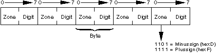
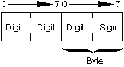
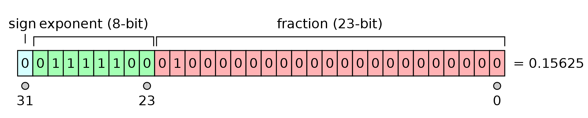
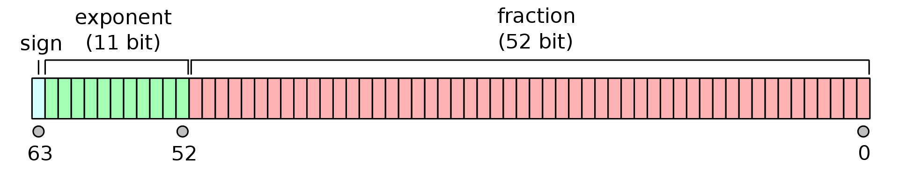

# 자료구조의 이해

## 자료구조의 개념
- 자료를 효율적으로 표현하고 저장하고 처리할 수 있도록 정리하는 것
- 여차저차 자료구조를 왜 배워야 하고 왜 이해해야 하는지를 줄줄 써놓은 이론적인 내용들...

## 자료구조의 분류
- 책에 나온 분류를 그대로 합니당
- 대충 자료의 특성과 주된 목적 등을 고려해서 잘 써라~

### 단순 구조
- 프로그래밍 언어에서 제공하는 데이터형에 해당
- 정수
- 실수
- 문자
- 문자열
- 등

### 선형 구조
- 논리적 순서에서 현재와 다음 자료 사이 관계가 1:1인 선형 구조
- 순차 리스트
  - 논리적 순서와 물리적 순서가 일치
- 연결 리스트
  - 논리적 순서대로만 연결
  - 단순 연결 리스트
  - 이중 연결 리스트
  - 원형 연결 리스트
- 스택
- 큐
- 데크
  - 제약 조건이 있는 리스트들
- 등

### 비선형 구조
- 1:다, 다:다 관계의 구조
  - 주로 계층, 망 구조
- 트리
  - 일반 트리
  - 이진 트리
- 그래프
  - 방향 그래프
  - 무방향 그래프

### 파일 구조
- 파일은 서로 관련 있는 필드로 구성된 레코드의 집합
  - 보조 기억 장치에 데이터가 실제로 기억되는 형태
- 순차 파일
- 색인 파일
- 직접 파일
- 이 책에선 파일 안 다룸...

# 자료의 표현

## 컴퓨터에서의 자료 표현
- 0과 1을 조합한 2진수 코드 사용
- 비트(Bit): 2진수 한 자리를 표현하는 단위로 디지털에서 최소 단위
- 니블(Nibble): 4비트 묶은 걸 말함. 16진수 한자리 표현 가능
- 바이트(Byte): 8비트 묶은 걸 말함.
- n개의 비트는 $ 2^n $개의 상태를 표현
  - 단순한 경우의 수

### 자료의 표현 분류
- 역시나 책 기준
- 자료의 표현
  - 수치 자료
    - 10진수
      - 존 형식
      - 팩 형식
    - 2진수
      - 정수
        - 부호 절댓값
        - 1의 보수
        - 2의 보수
      - 실수
        - 고정소수점
        - 부동소수점
  - 문자 자료
    - BCD 코드
    - EBCDIC 코드
    - ASCII 코드
    - 유니코드
  - 논리 자료
  - 포인터 자료
  - 문자열 자료

## 수치 자료의 표현
- 10진수로 쓰겠다고 삽질한 방식
- 2진수 방식 정수와 실수

### 10진수의 표현1: 존(Zone) 형식 표현
- 1바이트를 한 단위로 사용
- 바이트를 4비트씩 잘라서 존 영역과 수치 영역으로 구성함

  
[출처: IBM Documentation - Zoned-Decimal Format](https://www.ibm.com/docs/en/i/7.4?topic=type-zoned-decimal-format)

- 존 영역은 언제나 1111로 채움
  - 단, 최하단 바이트에서는 양수일 땐 1100, 음수일 땐 1101
- 수치 영역은 10진수 값을 2진수로 표현함
  - ex) 9 = 1001 저장

### 10진수의 표현2: 팩(Pack) 형식 표현
- 기존 존 방식은 쓰지 않는 영역이 많아서 용량 낭비가 심함
- 그래서 팩 형식에서는 부호를 표기하는 마지막 4비트를 제외하고 모두 수치로 사용
- 나머지는 존 형식과 동일

  
[출처: IBM Documentation - Packed-Decimal Format](https://www.ibm.com/docs/en/i/7.5?topic=type-packed-decimal-format)

### 2진수의 정수 표현
- 음이 아닌 정수는 그냥 2진수 동일하게 사용
- 음수는 컴퓨터에서 바로 표현할 수 없어서 다른 방식을 사용
  - 세 가지 방식이 나올 건데 다 최상위 비트(MSB: Most Significant Bit)가 1일 때 음수

#### 부호와 절댓값
- 최상위 비트는 부호를 나타내고 나머지 비트는 2진수 절댓값으로 표현

|+21|-21|
|:---:|:---:|
|**0**0010101|**1**0010101|

##### 부호와 절댓값 특징
- MSB만 바꾸면 돼서 음수를 간단하게 표현 가능
- 가산기, 감산기를 별도로 만들어야 해서 하드웨어 구성 비용이 큼
- +0, -0이 따로 존재해 논리적으로 맞지 않음
- n비트로 $ -(2^{n - 1} - 1) \sim (2^{n - 1} - 1) $ 범위를 표현 가능

#### 1의 보수
- 양수는 다른 것과 동일한 방식
- 음수는 1의 보수로 변환하여 표현
  - 1의 보수는 그냥 0을 1로 1은 0으로 뒤집으면 끝

|+21|-21|
|:---:|:---:|
|**0**0010101|**1**1101010|

##### 1의 보수 특징
- 뺄셈을 보수를 통해서 덧셈으로 할 수 있어 가산기만 있어도 됨
- -0, +0이 따로 존재해 논리적으로 맞지 않음
- n비트로 $ -(2^{n - 1} - 1) \sim (2^{n - 1} - 1) $ 범위를 표현 가능

#### 2의 보수
- 음수를 2의 보수로 표현
  - 1의 보수를 구하고 1을 더하면 됨

|+21|-21|
|:---:|:---:|
|**0**0010101|**1**1101011|

##### 2의 보수 특징
- 뺄셈을 보수를 통해서 덧셈으로 할 수 있어 가산기만 있어도 됨
- 오버플로 처리가 1의 보수 형식보다 간단함
- 실제로 컴퓨터 시스템에서 사용하는 형식
- n비트로 $ -2^{n - 1} \sim (2^{n - 1} - 1) $ 범위를 표현 가능

### 2진수의 실수 표현
- 직접적으로 표현 못 해서 정수부와 실수부의 위치를 정의해 실수를 표현

#### 고정소수점 표현 방식
- 소수점 위치가 고정되어 있다고 취급
- ex) 소수점이 최상위 비트 왼쪽에 있다.
  - $ 00010101 \Rightarrow 0.00010101 $ 

#### 부동소수점 표현 방식
- 과학적 표기 방식의 실수를 사용
  - $ n.nnn \times {base}^{exp} $ 형태
  - base는 밑수(= radix), exp는 지수 n.nnn부분이 소수부
- 부호, 지수, 가수의 세 영역으로 나눠서 사용
- 표현 범위에 따라 32비트 단정도(Single Precision)과 배정도(Double Precision)으로 나눔

[출처: https://en.wikipedia.org/wiki/IEEE_754-1985](https://en.wikipedia.org/wiki/IEEE_754-1985)

##### 변환 과정
- 어떤 숫자를 저장할 때 다음 과정을 거침
- 일단 2진수로 변환해서 표현됐다고 하고
1. 정규화: $ 1.nnn * 2^{exp} $ 꼴로 변환
2. 부호: 양수는 0, 음수는 1을 저장
3. 가수부: 항상 수가 1. 으로 시작한다고 가정하고 소수 부분만 저장

# 자료의 추상화
# 알고리듬의 이해
# 알고리듬의 표현 방법
# 알고리듬의 성능 분석