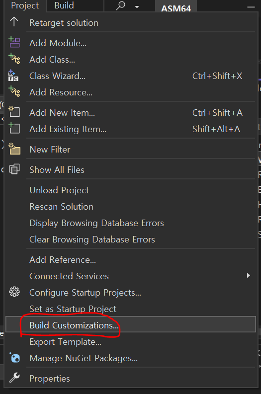
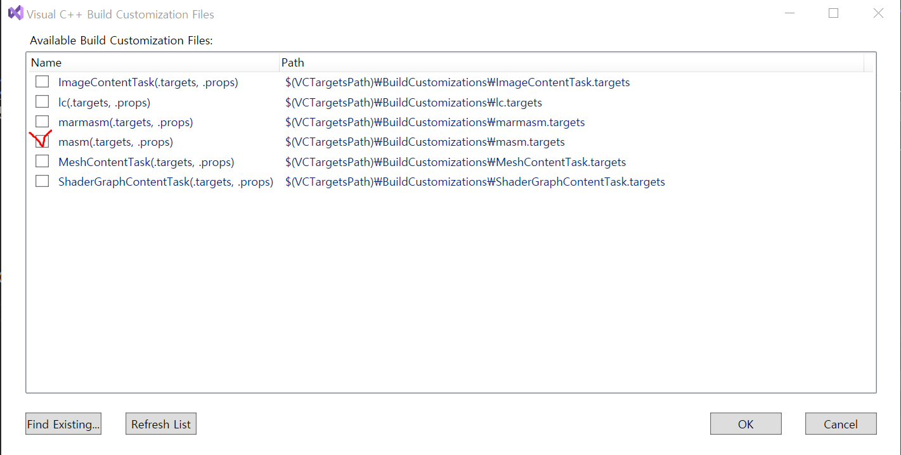
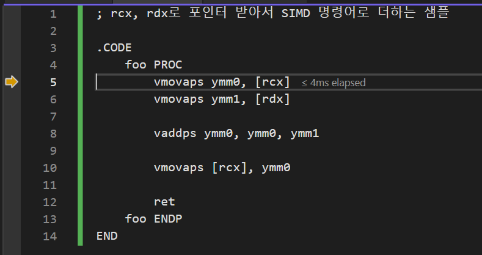
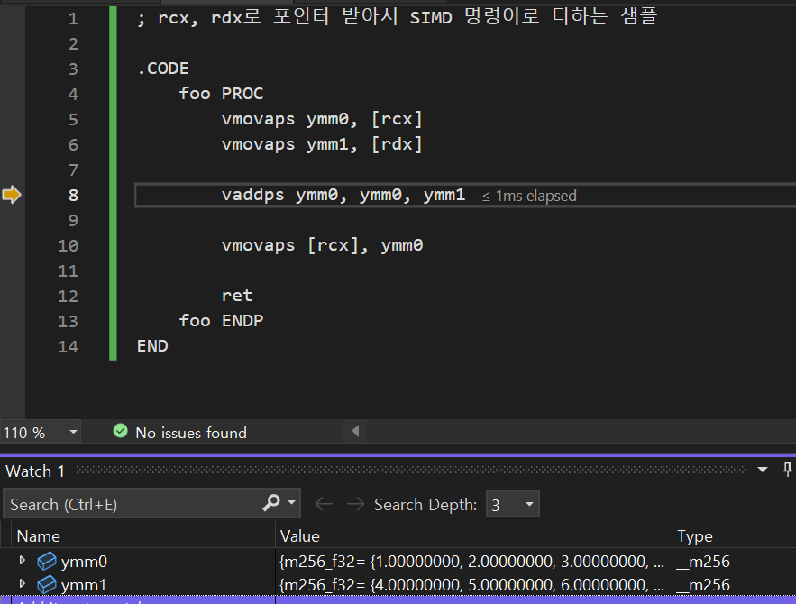

# 64비트로는 인라인이 없어서...
&emsp;개인적으로 비주얼스튜디오 인라인 어셈블러가 64비트를 지원하지 않아서 아쉽다고 생각만 하고 넘어갔었습니다. 그러다가 글 작성하는 시점에서야 찾아서 하게 됐는데 중단점도 있고 워치창도 되기도 하고 일단 비주얼스튜디오에서 쓸 수 있는 걸로 만족ㅋㅋ \\
&emsp;여튼 세팅도 어렵지 않으니 겸사겸사 세팅법 기록도 해놓고 샘플코드도 올려보려고 글을 써봅니다.

# 비주얼스튜디오 세팅 방법

#### 1. C++ 프로젝트 만들기
여긴 간단한 거니 설명은 패스!

#### 2. 빌드 커스터마이제이션 변경

- 이렇게 선택하고

- 요런 창이 나오면 선택해서 확인해줍니다.
- 저는 x64쓸 거니까 masm 선택

#### 3. asm 파일 추가
- 그냥 C++ 파일 선택하고 확장자를 asm로 바꾸면 됩니다.

#### 4. 어셈블리 코드 작성
```assembly
; rcx, rdx로 포인터 받아서 SIMD 명령어로 더하는 샘플

.CODE
	foo PROC
		vmovaps ymm0, [rcx]
		vmovaps ymm1, [rdx]
		
		vaddps ymm0, ymm0, ymm1
		
		vmovaps [rcx], ymm0
		
		ret
	foo ENDP
END
```
- 어차피 샘플용이니 대강 짜고

#### 5. 사용
```C++
#include <iostream>

extern "C" void foo(const float* nums1, const float* nums2);

int main()
{
	_declspec(align(256)) float nums1[] = { 1.f, 2.f, 3.f, 4.f, 1.f, 2.f, 3.f, 4.f };
	_declspec(align(256)) float nums2[] = { 4.f, 5.f, 6.f, 7.f, 4.f, 5.f, 6.f, 7.f };

	foo(nums1, nums2);

	std::cout << nums1[0] << ", "
		<< nums1[1] << ", "
		<< nums1[2] << ", "
		<< nums1[3] << std::endl;
}
```
- 어셈블리로 작성한 심볼을 사용하려면 extern "C" (선언문) 요런 식으로 하라고 하네요
- 여기선 간단하게 해서 그냥저낭 쓰겠는데 나중에 문제 상황 보면 그때그때 검색해서 해결하게 될 것 같군요.

#### 6. 실제 사용 스크린샷

- 요렇게 호출하고 step into 기능으로 쏙 들어가면

- 잘 들어가고

- 자동으로 안 해줘서 번거로울 순 있긴 하지만 워치로 확인도 가능합니다.

#### 추가
~~~assembly
includelib msvcrt.lib
includelib legacy_stdio_definitions.lib

extern puts : PROC

.DATA
message BYTE "Hello World", 0

.CODE
	foo2 PROC

		lea rcx, message

		push rcx
		call puts
		pop rcx

		ret
	foo2 ENDP
END
~~~
- C함수 불러서 쓰는 예제

# 그래도 역시...
## 인라인 지원해줘라!(?)